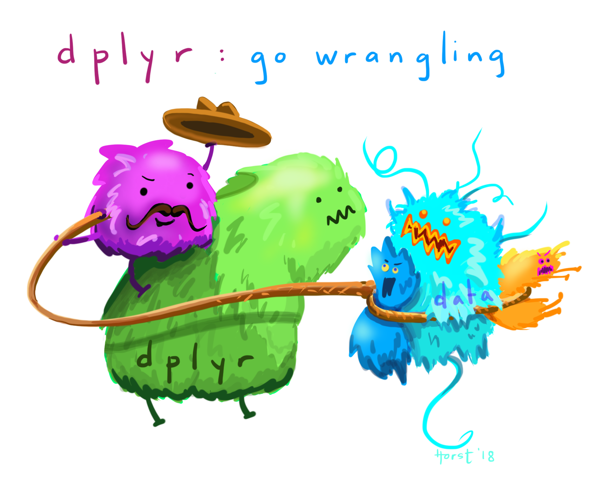

# The Basics of Geographic Information data {-}
Geographic data, geospatial data or geographic information is data that identifies the location of features on Earth. There are two main types of data which are used in GIS applications to represent the real world. **Vectors** that are composed of points, lines and polygons and **rasters** that are grids of cells with individual values...

```{r echo=FALSE, out.width = "300pt", fig.align='center', cache=FALSE, fig.cap="Types of spatial data. Source: [Spatial data models](https://planet.uwc.ac.za/nisl/gis/web_page/page_15.htm)"}
knitr::include_graphics('prac1_images/rasvsvec.png') 
```

In the above example the features in the real world (e.g. lake, forest, marsh and grassland) have been represented by points, lines and polygons (vector) or discrete grid cells (raster) of a certain size (e.g. 1 x 1m) specifying land cover type.

##Data types in statistics

Before we go any further let's just quick go over the different types of data you might encounter

Continuous data can be measured on some sort of scale and can have any value on it such as height and weight.

Discrete data have finite values (meaning you can finish counting something). It is numeric and countable such as number of shoes or the number of computers within the classroom.

Foot length would be continuous data but shoe size would be discrete data.

```{r echo=FALSE, out.width = "450", fig.align='center', cache=FALSE, fig.cap="Continuous and discrete data. Source: [Allison Horst data science and stats illustrations](https://github.com/allisonhorst/stats-illustrations)"}
knitr::include_graphics('allisonhorst_images/continuous_discrete.png')
```

Nominal (also called categorical) data has labels without any quantitative value such as hair colour or type of animal. Think names or categories - there are no numbers here. 

Ordinal, similar to categorical but the data has an order or scale, for example if you have ever seen the chilli rating system on food labels or filled a happiness survey with a range between 1 and 10 --- that's ordinal. Here the order matters, but not the difference between them.

Binary data is that that can have only two possible outcomes, yes and no or shark and not shark.

```{r echo=FALSE, out.width = "550pt", fig.align='center', cache=FALSE, fig.cap="Nominal, ordinal and binary data. Source: [Allison Horst data science and stats illustrations](https://github.com/allisonhorst/stats-illustrations)"}
knitr::include_graphics('allisonhorst_images/nominal_ordinal_binary.png')
```

## Important GIS data formats

There are a number of commonly used geographic data formats that store vector and raster data that you will come across during this course and it's important to understand what they are, how they represent data and how you can use them.

### Shapefiles

Perhaps the most commonly used GIS data format is the shapefile. Shapefiles were developed by [ESRI](http://www.esri.com/), one of the first and now certainly the largest commercial GIS company in the world. Despite being developed by a commercial company, they are mostly an open format and can be used (read and written) by a host of GIS Software applications.

A shapefile is actually a collection of files ---- at least three of which are needed for the shapefile to be displayed by GIS software. They are:

1.  `.shp` - the file which contains the feature geometry
2.  `.shx` - an index file which stores the position of the feature IDs in the `.shp` file
3.  `.dbf` - the file that stores all of the attribute information associated with the coordinates -- this might be the name of the shape or some other information associated with the feature
4.  `.prj` - the file which contains all of the coordinate system information (the location of the shape on Earth's surface). Data can be displayed without a projection, but the `.prj` file allows software to display the data correctly where data with different projections might be being used

### GeoJSON

GeoJSON [Geospatial Data Interchange format for JavaScript Object Notation](http://geojson.org/) is becoming an increasingly popular spatial data format, particularly for web-based mapping as it is based on JavaScript Object Notation. Unlike a shapefile in a GeoJSON, the attributes, boundaries and projection information are all contained in the same file.

### Shapefile and GeoJSON

We're now going to explore a shapefile (`.shp` ) and GeoJSON (`.geojson`) in action.

Go to: <http://geojson.io/#map=16/51.5247/-0.1339>

```{r echo=FALSE, out.width = "500pt", fig.align='center', cache=FALSE}
knitr::include_graphics('prac1_images/JSONwebsite.png') 
```

1.  Using the drawing tools to the right of the map window, create 3 objects: a point, line and a polygon as I have done above. Click on your polygon and colour it red and colour your point green
2.  Using the 'Save' option at the top of the map, save two copies of your new data -- one in `.geojson` format and one in `.shp` format
3.  Open your two newly saved files in a text editor such as notepad or notepad++. For the shapefile you might have to unzip the folder then open each file individually. What do you notice about the similarities or differences between the two ways that the data are encoded?

### Raster data

Most raster data is now provided in GeoTIFF (`.tiff`) format, which stands for Geostarionary Earth Orbit Tagged Image File. The GeoTIFF data format was created by NASA and is a standard public domain format. All necesary information to establish the location of the data on Earth's surface is embedded into the image. This includes: map projection, coordinate system, ellipsoid and datum type.

### Other data formats

Aforementioned data types and formats are likely to be the ones you predominately encounter. However there are several more used within spatial analysis. These include:

**Vector**

-   GML (Geography Markup Language ---- gave birth to Keyhold Markup Language (KML))

**Raster**

-   Band SeQuential (BSQ) - technically a method for encoding data but commonly referred to as BSQ.
-   Hierarchical Data Format (HDF)
-   Arc Grid

There are normally valid reasons for storing data in one of these other formats. For example, BSQ are raster data with a separate text header file (`.hdr`) providing geographic spatial reference information. Earth observation data often monitors the electromagnetic spectrum in bands. Humans see in the visible range of the spectrum and our vision is composed of red, green and blue wavelengths. If we wanted to analyse just the red wavelength the BSQ format would let us *read in* only that data. In comparison a GeoTIFF might come with all the data 'packaged' in one file and when doing analysis over thousands of images would significantly slow things down. That said you can now often find GeoTIFFs separated in a similar format to BSQ and it's fairly straightforward to convert between raster formats.

### Geodatabase

A geodatabase is a collection of geographic data held within a database. Geodatabases were developed by ESRI to overcome some of the limitations of shapefiles. They come in two main types: Personal (up to 1 TB) and File (limited to 250 - 500 MB), with Personal Geodatabases storing everything in a Microsoft Access database (`.mdb`) file and File Geodatabases offering more flexibility, storing everything as a series of folders in a file system. In the example below we can see that the FCC_Geodatabase (left hand pane) holds multiple points, lines, polygons, tables and raster layers in the contents tab.

```{r echo=FALSE, out.width = "500pt", fig.align='center', cache=FALSE}
knitr::include_graphics('prac1_images/geodatabase.png') 
```

### GeoPackage

```{r echo=FALSE, out.width = "100pt", fig.align='center', cache=FALSE, fig.cap="GeoPacakge logo"}
knitr::include_graphics('prac1_images/geopkg.png')
```

A GeoPackage is an open, standards-based, platform-independent, portable, self-describing, compact format for transferring geospatial data. It stores spatial data layers (vector and raster) as a single file, and is based upon an SQLite database, a widely used relational database management system, permitting code based, reproducible and transparent workflows. As it stores data in a single file it is very easy to share, copy or move.

### SpatiaLite

```{r echo=FALSE, out.width = "100pt", fig.align='center', cache=FALSE, fig.cap="SpatialLite logo"}
knitr::include_graphics('prac1_images/spatialite.png')
```

SpatialLite is an open-source library that extends SQLite core. Support is fairly limited and most software that supports SpatiaLite also supports GeoPackage, as they both build upon SQLite. It doesn't have any clear advantage over GeoPackage, however it is unable to support raster data.

### PostGIS

```{r echo=FALSE, out.width = "100pt", fig.align='center', cache=FALSE, fig.cap="PostGIS logo"}
knitr::include_graphics('prac1_images/postGIS.jpg') 
```

PostGIS is an opensource database extender for PostrgeSQL. Essentially PostgreSQL is a database and PostGIS is an add on which permits spatial functions. The advantages of using PostGIS over a GeoPackage are that it allows users to access the data at the same time, can handle large data more efficiently and reduces processing time. In [this example](https://medium.com/@GispoLearning/learn-spatial-sql-and-master-geopackage-with-qgis-3-16b1e17f0291) calculating the number of bars per neighbourhood in Leon, Mexico the processing time reduced from 1.443 seconds (SQLite) to 0.08 seconds in PostGIS. However, data stored in PostGIS is much harder to share, move or copy.

### What will I use

The variety of data formats can see a bit overwhelming. I still have to check how to load some of these data formats that I don't use frequently. But don't worry, most of the time you'll be using shapefiles, GeoPackages or raster data.

## General data flow

As Grolemund and Wickham state in [R for Data Science](https://r4ds.had.co.nz/)...

> "Data science is a huge field, and there's no way you can master it by reading a single book."

However, a nice place to start is looking at the typical workflow of a data science (or GIS) project which you will see throughout these practicals, which is summarised nicely in this diagram produced by [Dr. Julia Lowndes](https://twitter.com/juliesquid) adapted from Grolemund and Wickham.

```{r echo=FALSE, out.width = "600pt", fig.align='center', cache=FALSE, fig.cap="Updated from Grolemund & Wickham's classis R4DS schematic, envisioned by Dr. Julia Lowndes for her 2019 useR! keynote talk and illustrated by Allison Horst. Source: [Allison Horst data science and stats illustrations](https://github.com/allisonhorst/stats-illustrations)"}
knitr::include_graphics('allisonhorst_images/environmental_data_science_r4ds_general.png')
```

To begin you have to **import** your data (not necessarily environmental) into R or some other kind of GIS to actually be able to do any kind of analysis on it.

Once imported you might need to **tidy** the data. This really depends on what kind of data it is and we cover this later on in the course. However, putting all of your data into a consistent structure will be very beneficial when you have to do analysis on it --- as you can treat it all in the same way. Grolemund and Wickham state that data is tidy when "each column is a variable, and each row is an observation", we cover this more in next week in the [Tidying data] section.

When you have (or haven't) tidied data you then will most likely want to **transform** it. Grolemund and Wickham define this as "narrowing in on observations of interest (like all people in one city, or all data from the last year), creating new variables that are functions of existing variables (like computing speed from distance and time), and calculating a set of summary statistics (like counts or means)". However, from a GIS point of view I would also include putting all of your data into a similar projection, covered next week in [Changing projections] and any other basic process you might do before the core analysis. Arguably these processes could include things such as: clipping (cookie cutting your study area), buffering (making areas within a distance of a point) and intersecting (where two datasets overlap).

Tidying and transfrom = data wrangling. Remember from the introduction this could be 50-80% of a data science job!

```{r echo=FALSE, out.width = "450pt", fig.align='center', cache=FALSE, fig.cap="dplyr introduction graphic. Source: [Allison Horst data science and stats illustrations](https://github.com/allisonhorst/stats-illustrations)"}

```

After you have transformed the data the next best thing to do is **visualise** it --- even with some basic summary statistics. This simple step will often let you look at your data in a different way and select more appropraite analysis.

Next up is **modelling**. Personally within GIS i'd say a better term is processing as the very data itself is usually a computer model of reality. The modelling or processing section is where you conduct the core analysis (more than the basic analysis already mentioned) and try to provide an answer to your research question.

Fianlly you have to **communicate** your study and outputs, it doesn't matter how good your data wrangling, modelling or processing is, if your intended audience can't interpret it, well, it's pretty much useless.

::: {.infobox .tip data-latex="{note}"}
In a few weeks come back and revisit this data flow section to see how what you have learnt fits the framework presented.
:::

## Data sources and task

Below I've listed a few good data sources for you to explore in future.

### UK Data Service

The UK Data Service geography service (<https://census.edina.ac.uk/>) has a library of hundreds of current and former boundary datasets for which attribute data are produced in the UK.

### ONS

The Office for National Statistics (ONS) are the national statistical agency for England and Wales and have recently started to provide access to boundary data for the statistics they produce for various geographic areas.

Many of the boundaries on the [ONS Geoportal](http://geoportal.statistics.gov.uk/) are also available from the Edina Census Geography website in a more flexible fashion, however the ONS website provides very quick access to bulk-downloads --- something which can be very useful when reading data directly from the web using computer software. From the ONS website you can also extract the URL at which the data is stored to use directly within your future code...

### nomis

Nomis is provided by the ONS giving free access to UK labour market statistics. You can also [bulk download census data](https://www.nomisweb.co.uk/census/2011/bulk/r2_2) from the site too!

### OS

The Ordnance Survey (OS) are the national mapping agency for the UK. A few years ago, they opened up a number of their data products for public use including greenspace, OS Open Map and OS Terrain.

For the full range see: [https://www.ordnancesurvey.co.uk/business-and-government/products/finder.html?Licensed%20for=OpenData%20(Free)&withdrawn=on](https://www.ordnancesurvey.co.uk/business-and-government/products/finder.html?Licensed%20for=OpenData%20(Free)&withdrawn=on){.uri}

### Edina Digimap

Before the Ordnance Survey opened up much of its data for public use, academics and students in the UK could access OS data using the Edina Digimap Service ---- this service is still available today and provides access to a number of products in addition to those available from OS Open Data.

Perhaps the most exciting of the additional OS data products available from Digimap is OS MasterMap. MasterMap is a framework for all OS data and contains layers of data that include details of real world objects such as buildings, roads, paths, rivers, physical structures and land parcels, as well as the complete UK transport network. Whilst we still are required to go through Edina OS have recently announced plans to make this dataset free in the near future under the new Geospatial Commission.

```{r echo=FALSE, out.width = "500pt", fig.align='center'}
knitr::include_graphics('prac1_images/mastermap.png') 
```

### OSM

Open Street Map (OSM) is a fantastic resource ---- as the name suggests, all data contained in Open Street Map are open and free for anyone to use. Much like Wikipedia, anyone can contribute content to OSM and this brings with it its own benefits (frequent updates, very large user-base) and problems (data quality and patch coverage). OSM is a very good example of Volunteered Geographic Information (VGI).

It's possible to download OSM data straight from the website, although the interface can be a little unreliable (it works better for small areas). There are, however, a number of websites that allow OSM data to be downloaded more easily and are directly linked to from the 'Export' option in OSM. Geofabrik (<https://www.geofabrik.de/data/download.html>) allows you to download frequently updated Shapefiles for various global subdivisions.

### DEFRA

The Department for Environment and Rural Affairs (DEFRA) have recently created the Data Services Platform to openly distribute environmental data. See: <https://environment.data.gov.uk/>

### Data lists

Another good place to start searching for data are data lists. They simply provide a comprehensive overview of all available data conveniently categorised by discipline and country.

I normally use this one: <https://freegisdata.rtwilson.com/>

## Summary
