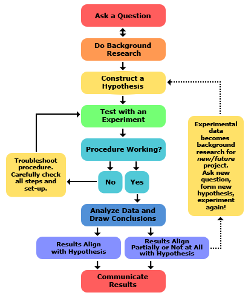

# (PART\*) Assignment {-}

# Assignment requirements

```{r echo=FALSE}
library(knitr)
```

## Requirements

**Deadline:** Monday 13th January 2020, 5pm. There are no opportunities to submit a second version after this deadline, this means it's a one time only submission.

**Submission:** PDF via Moodle. If anything other than a .pdf is submitted **it will not be marked**. 

**Coversheet:** You must have a coversheet at the start of your assignment (within the single PDF) that includes your assignment title, programme, department, GitHub repository URL and any online website / instructions you have created (e.g. RPubs). There is no standard format for the cover sheet, just ensure it has all the required information. It is not included in the word count. **Check all of your URLs work (e.g. in a different browser)**.

**Weighting:** This assessment makes up 100% of the marks for this module but is divided into two parts (worth 50% each) that must be submitted together in a single PDF document.

**Assessment outline:**

For the assessment of this course you will combine the cartographic and GIScience skills you have learned over the last 10 weeks to showcase your abilities as a fully rounded spatial analyst. Your task is to carry out a mini research project which answers a pertinent or topical geo-spatial question/hypothesis/issue in a logical, scientific and reproducible manner. Your project can be located anywhere on Earth and at any spatial scale (e.g. local, national, international) but must involve analysis of some appropriate spatial data (raster, vector or both) that you have sourced yourself. You must not reuse the data we provided in the practical sessions. You will submit only one document, but the assessment process will be divided into 2 parts detailed below, each worth 50% of the final grade and around 1500 words. The final total (of both parts combined) should not exceed 3000 words excluding references. The reference list should be provided on a new page within your PDF document. You must conduct your analysis using R and/or QGIS.

**Part 1**

In part 1 of the assessment you are required to construct a relevant spatial problem founded upon relevant and pertinent literature (e.g. academic and policy) and propose a methodology to test your hypothesis. In this section we expect to see an: introduction, research question (or hypothesis), literature review and methodology.

**Part 2**

In part 2 of the assessment you must then test the research question or hypothesis you developed in part 1 with appropriate and reproducible geographic data analysis as specified in your methodology. In this section we expect to see a results section (that includes descriptive and further analysis), discussion and conclusion (that includes recommendations). Start part 2 on a new page.
Visualisation of the assessment

The graphic below provides a visual representation of division of the assessment between these two parts, but make sure you include everything that is requested in the Part 1 and Part 2 sections on this page.

```{r echo=FALSE, out.width = "700pt", fig.align='center', cache=TRUE}

```

## Marking scheme

The mark scheme is what the markers will use to grade your work. Read it regularly (at least once a week) and reflect on how you are meeting each criterion. 

```{r echo=FALSE, out.height = "600pt", out.width = "800pt", cache=TRUE}
include_graphics('assignment/GIS-MarkScheme-2019.pdf', auto_pdf = getOption("knitr.graphics.auto_pdf", FALSE)
)
```

You can also download this [mark scheme from my GitHub](https://github.com/andrewmaclachlan/CASA0005repo/blob/master/assignment/GIS-MarkScheme-2019.pdf)

## Expected timeline

The table below is simply complied from the recommeded homework assignments provided within each practical.

```{r, cache=T, echo=FALSE, message=FALSE}
library(readxl)
library(kableExtra)
timeline <- read_excel('general_data/timeline.xlsx')

kable(timeline, align=(c('c', 'l')), valign="middle") %>%
    kable_styling(bootstrap_options = c("striped", "hover", "condensed", "responsive")) %>%
    row_spec(0, align = "c") %>%
    column_spec(1, bold = T, border_right = T) %>%
    collapse_rows(columns = 0:2)
```

## Penalities 

Late submission  of the assessment will be subject to the [standard penalties according to the UCL regulations](https://www.ucl.ac.uk/academic-manual/chapters/chapter-4-assessment-framework-taught-programmes/section-3-module-assessment#3.12)

Similarly any academic misconduct will follow the [UCL adjudication and penalty guidance](https://www.ucl.ac.uk/academic-manual/sites/academic-manual/files/student_academic_misconduct_adjudication_and_penalties.pdf)

## Frequently Asked Questions

**What criteria will you mark our work on**

We will follow the mark scheme for this course available on Moodle.

**What spatial scale should i use**

Data is key to the assignment, i would avoid anything at the Borough level or coarser (or equivalent in other global city). Find decent data first then develop your question.

**Can I use multiple datasets**

Yes, you can use as many as you like as long as they are appropriate for the research question/hypothesis.

**Can I use more words in part 1 / part 2 than recommended**

You can but as each part is worth 50% we’d recommend using 1,500 per section. The whole document must not exceed 3,000 words (excluding references).

**How will you determine part 1 and part 2**

Part 1 will be everything before the results section, part 2 will be everything after.

**Can I do my analysis using a range of different software**

Yes. You may wish to run your analysis in R and produce a map in QGIS or vice versa with an interactive map. But make sure your analysis remains reproducible as per the mark scheme for the course.

**What must be included in the report and do I submit as a single document**

We recommend that you follow the format of a traditional scientific detailed above. Yes, you will submit the document as a single PDF.

**What do you mean by ‘You must not reuse the data we provided in the practical sessions’**

Any data we have used in the practical session must not appear in your final assessment. However, if you wanted to use data collected from the same source but of a different study area that would be acceptable. For example, Landsat data over Paris or Airbnb data from Berlin are fine. You can use code and ideas from the practicals, but do not just directly copy it with the data we have given you. For example, you could explore the relationship between two varaibles and combine methods from across the practicals, perhaps bootstrap resampling and cross validation?

**So where do I get the data from**

Checkout the [Assignment resources] pages for help. You can use any of this data listed on this page as long as we haven’t directly used it within the practical sessions. This list is just for guidance and you are not restricted to it. Go and explore!

**Can I use methods not covered in the course and can I use another piece of software (e.g. Python)**

Yes and no. Make sure you select only appropriate methods for your proposed analysis and as the course focuses on R and QGIS we expect the analysis to be completed within them.

**Can I just use methods covered in the course **

Yes, you can and if you have provided a decent write up it is likely you will pass. However, we strongly encourage you to explore other methods.

**How should I display my results**

However you deem appropriate for your data and analysis. A reader should be able to understand any figure you have produced using only the figure and the caption. Check out the practical on {Map making] for cartography advice and guidance. 

**Can I use interactive maps**

Yes, but only where appropriate for your data and analysis. You can recreate any of the online mapping tools we demonstrated and link this into the PDF document you submit. For example, you could display a static map in your submitted work that is hyperlinked to an RPubs, RMarkdown site or Shiny. 

**How can I show my code or QGIS tool within the assignment**

If you want to provide reproducible code for your analysis then follow the relevant practical within the practical book. You can then provide a hyperlink to the url/repository within your PDF report. If you have made a QGIS model you should still be able to upload it to GitHub, GoogleDirve, Dropbox or OneDrive and provide a hyperlink. However, make sure that whatever you choose to do, it is reproducible with appropriate documentation

**I've used a large dataset do i need to provide all of it**

No, please do not upload a large file (e.g. 10GB). If you have made use of a large dataset (e.g. perhaps earth observation data) then either just share the data for the study area or include  details of the data you used so someone else could find it and replicate the analysis. 

**Does my code / associated Readme file / documentation / online site count towards the word limit**

No, but any documentation with the code should only succinctly describe what the code does and provide no interpretation of analysis, results, methods, discussion or the conclusion. You can make an online document / website that explains what each part of the code does, as we did in the practical sessions, but absolutely no interpretation of results.

**What is included in the word count** 

The maximum length for the whole document is 3,000 words. This should be divided into around 1,500 for part 1 and 2 – remember each part is worth 50%. This count includes everything above the reference list. The reference list should be the last section provided on a separate page.

**Do I need to use references**

Yes, we are expecting your project to use a variety of credible sources (e.g. academic literature and policy documents) following the Harvard referencing system.

**What’s a credible reference**

Something that is unbiased and can be supported with evidence. Generally, this would include academic journals, reviews and books alongside evidenced based policy documents. It would exclude online sources such as Wikipedia.

**Can I use flowcharts**

Yes, and we strongly encourage them, but make sure they are relevant and fit for purpose.

**Can I use private data**

Private data would entail something that is not publicly accessible or open. For example, if you work for a company and they have given you access to a private dataset that they have complied. You can use private data, but there are no extra marks for doing so. That said if you aren’t able to publish the data in a repository (because it’s private) you won’t lose any marks in terms of reproducibility, but we’d recommend making up a mock dataset so we can see your code/toolbox/analysis actually works. This data wouldn’t need to show the same result as your original private dataset, most likely it shouldn’t as it could risk identifying the original data. Please make sure you fully acknowledge the source of any private data, as with all data. If this applies to you and you wish to use private data throughout your MSc make sure other module coordinators also agree.

**Can I scrape data from the web**

Yes as long as you follow the terms and conditions from where you sourced the data and clearly state this along with how you have adhered to them in your final report and also any repository / reproducible material. Comments in your code should just say where the data is from, adherence should be in the report and any reproducibility online document you create (e.g. RPubs / similar). You probably won’t be able to store the original data in a personal online repository so it might be useful to have a random mock dataset (probably a smaller dataset) to show it runs.

